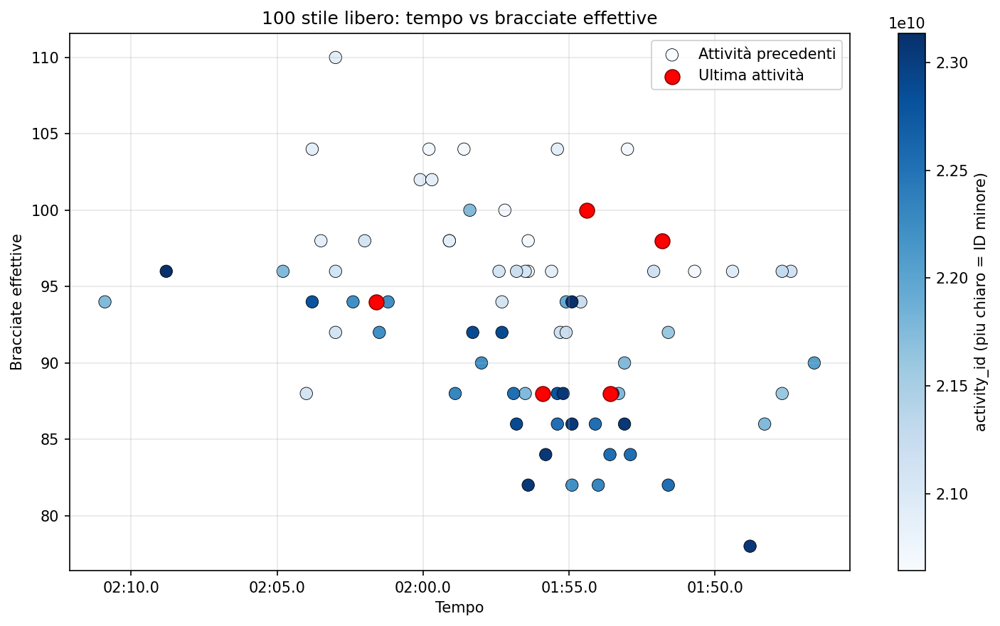

# Analisi Nuoto

Pipeline per analizzare allenamenti di nuoto esportati in CSV, partendo dai file
dei singoli lap/vasche e arrivando a dataset puliti per distanza/stile piu'
grafici tempo/bracciate.

Esempio di output finale:



Il grafico mette in relazione il tempo sui 100 stile libero con le bracciate
effettive: ogni punto rappresenta una riga del dataset finale e il colore aiuta
a distinguere gli allenamenti nel tempo.

## Cosa fa la pipeline

L'input di partenza sono piu' file CSV, uno per allenamento, messi nella cartella
`data/input/`. Ogni CSV contiene le righe dei lap di quell'allenamento: stile,
distanza, tempo, swolf, bracciate e altri dati registrati dall'app o dal device.

Esempio semplificato di un file `data/input/activity_20584599774.csv`:

```csv
"","Ripetute","Stile","Vasche","Distanza","Tempo","Tempo cumulato","Passo medio","Passo migliore","Swolf medio","FC Media","FC max","Totale bracciate","Bracciate medie","Calorie"
"","1","Misto","30","750","22:00","22:00","2:35","1:40","51","133","159","363","12","206"
"","1.1","Stile libero","1","25","0:34.4","0:34.4","2:18","2:18","45","105","124","11","--","--"
"","1.2","Stile libero","1","25","0:31.7","1:06.1","2:07","2:07","42","125","137","10","--","--"
```

Il nome del file e' importante perche' diventa l'identificativo
dell'allenamento. Per esempio, dal file `activity_20584599774.csv` viene
aggiunto `activity_id = activity_20584599774` a tutte le righe lette da quel
CSV.

La pipeline completa fa tre passaggi:

1. Unisce tutti i CSV degli allenamenti.
   Legge tutti i file `*.csv` presenti in `data/input/`, li ordina per nome,
   li carica con pandas, aggiunge la colonna `activity_id` e salva un unico
   file in `data/processed/merged_laps.csv`.

2. Costruisce il dataset per distanza e stile.
   Dal CSV unificato tiene solo le righe con lo stile e la distanza scelti
   (`50`, `100` o `200`). Poi converte `Totale bracciate` in numero, calcola
   `Bracciate effettive = Totale bracciate * 2` e salva solo le colonne utili:
   `Tempo`, `Swolf medio`, `Totale bracciate`, `Bracciate effettive`,
   `activity_id`.

3. Genera il grafico finale.
   Legge il dataset filtrato, converte il tempo in secondi e produce
   uno scatter plot in cui:
   - l'asse X e' il tempo della distanza/stile scelti;
   - l'asse Y sono le bracciate effettive;
   - il colore indica l'ordine/ID dell'allenamento.

Alla fine ottieni questi file:

```text
data/processed/merged_laps.csv
data/processed/100_stile.csv
data/output/100_stile_scatter.png
data/processed/50_dorso.csv
data/output/50_dorso_scatter.png
```

`merged_laps.csv` serve come base unica con tutti i lap di tutti gli
allenamenti. I file come `100_stile.csv` o `50_dorso.csv` sono dataset specifici
per confrontare una distanza e uno stile. I file `*_scatter.png` sono i grafici
per vedere come cambiano tempo e bracciate tra gli allenamenti.

## Setup e utilizzo

### 1. Prepara Python

Serve Python 3.8 o superiore. Da PowerShell, dentro alla cartella del progetto:

```powershell
python -m venv .venv
.venv\Scripts\Activate.ps1
python -m pip install -e .
```

L'installazione in modalita' editable (`-e .`) rende disponibile il comando
`analisi_nuoto` e installa le dipendenze dichiarate nel progetto.

Se preferisci installare solo da `requirements.txt`:

```powershell
python -m pip install -r requirements.txt
```

### 2. Metti i CSV degli allenamenti nella cartella giusta

Metti i file CSV dei tuoi allenamenti in:

```text
data/input/
```

Esempio:

```text
data/input/activity_20584599774.csv
data/input/activity_20623398286.csv
data/input/activity_20643588788.csv
```

I file possono avere nomi diversi, ma e' comodo mantenere un nome stabile e
riconoscibile: il nome senza `.csv` viene usato come `activity_id`.

### 3. Esegui tutta la pipeline

```powershell
analisi_nuoto run
```

Questo comando esegue merge, preparazione del dataset e generazione del grafico.
Di default analizza i `100` `Stile libero`.

Per scegliere distanza e stile:

```powershell
analisi_nuoto run --distance 50 --style Dorso
analisi_nuoto run --distance 200 --style Rana
```

Le distanze supportate sono definite nel progetto e includono `50`, `75`, `100`
e `200`. Lo stile viene confrontato con la colonna `Stile` del CSV; sono
supportati anche alias comuni come `stile` per `Stile libero`.

Per aprire anche la finestra del grafico mentre viene generato:

```powershell
analisi_nuoto run --show-plot
```

### 4. Esegui i passaggi separatamente

Se vuoi lanciare un solo pezzo alla volta:

```powershell
analisi_nuoto merge
analisi_nuoto prepare --distance 100 --style "Stile libero"
analisi_nuoto plot --distance 100 --style "Stile libero"
```

I vecchi comandi `prepare-100-stile` e `plot-100-stile` restano disponibili come
alias per il caso storico dei 100 stile libero.

### 5. Apri la dashboard interattiva

Per esplorare distanza e stile da menu a tendina:

```powershell
analisi_nuoto dashboard
```

La dashboard usa `data/processed/merged_laps.csv` come sorgente e aggiorna il
grafico in tempo reale quando cambi distanza o stile. Se vuoi usare un CSV
unificato diverso:

```powershell
analisi_nuoto dashboard --merged-laps-csv data/processed/merged_laps.csv
```

Di default Streamlit apre la dashboard su `http://localhost:8501`.

Per spegnerla:
```powershell
Stop-Process -Id 2716,21244  
``` 

### 6. Cambia percorsi di input/output

Di default la pipeline usa:

```text
input:  data/input/
merge:  data/processed/merged_laps.csv
csv:    data/processed/<distanza>_<stile>.csv
plot:   data/output/<distanza>_<stile>_scatter.png
```

Puoi sovrascrivere i percorsi da CLI:

```powershell
analisi_nuoto run `
  --raw-laps-dir data/input `
  --merged-laps-csv data/processed/merged_laps.csv `
  --distance 50 `
  --style Dorso `
  --swim-csv data/processed/50_dorso.csv `
  --swim-plot data/output/50_dorso_scatter.png
```

### 7. Se il comando non viene trovato

Se `analisi_nuoto` non e' disponibile, puoi usare direttamente Python:

```powershell
.venv\Scripts\python.exe -m analisi_nuoto run
```
